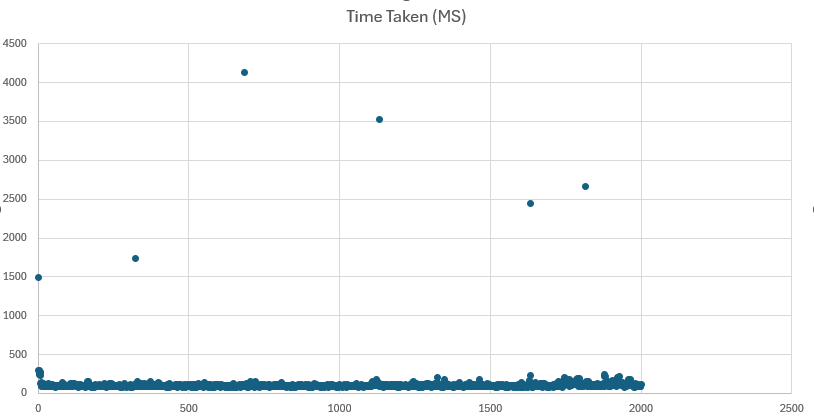

# Creating in Batches

Using C# and the [Neo4j.Driver](https://www.nuget.org/packages/Neo4j.Driver/5.28.1) (v 5.28.1) you can `CREATE` a set number of nodes in batches of a size you determine.

This uses [LinqPad](https://www.linqpad.net/) to execute, but you should be able to extract the C# eqsily enough by removing the `XML` at the top of the file.

## What to change

* Line 25 (in the [`.linq`](CreatingInBatches.linq)) file is where you set the amount of nodes to create and the batch size.

```
var batches = GenerateBatches(5000, 100000);
```

Will generate `100,000` nodes in batch sizes of `5,000`

Just change the numbers to what you want.

The output will be straight to the console, I can add a file output if needed, but if you take those values and plot them you will get something like this:



## Notes!

There is no safety here, nor checks, and the actual creation of the node does some odd things with adding labels etc for _reasons_.
